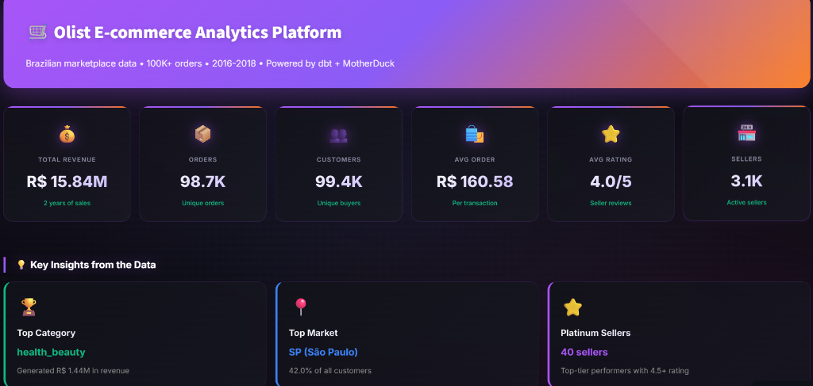
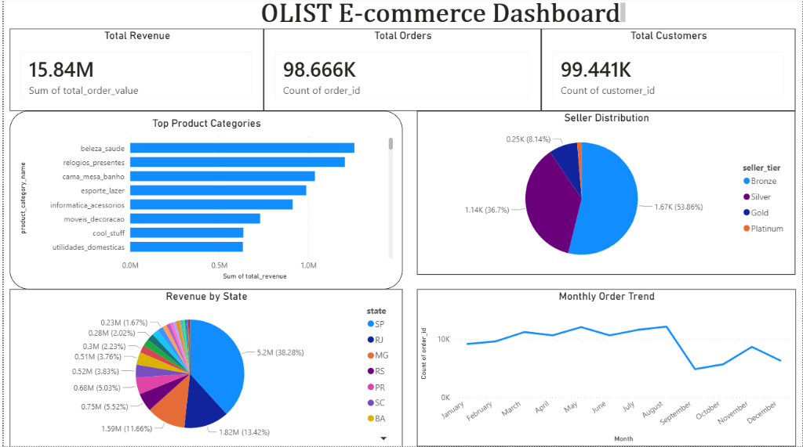

<div align="center">

# 🛒 Olist E-commerce Analytics Platform

### End-to-end data pipeline with dbt, MotherDuck & Streamlit

[](https://olist-analytics-platform.streamlit.app/)
[](https://mohith-akash.github.io/olist-analytics-platform/)
[](https://github.com/Mohith-akash/olist-analytics-platform/actions/workflows/ci.yml)
[](https://python.org)
[](https://motherduck.com)
[](https://github.com/astral-sh/ruff)

**[Live Dashboard](https://olist-analytics-platform.streamlit.app/)** · **[dbt Docs](https://mohith-akash.github.io/olist-analytics-platform/)** · **[Dataset](https://www.kaggle.com/olistbr/brazilian-ecommerce)**

</div>

---

## 🎯 Overview

A complete analytics platform analyzing **100,000+ orders** from Brazilian e-commerce marketplace Olist (2016-2018). Built to demonstrate:

- **Data Engineering** - ETL pipelines, dimensional modeling
- **SQL Expertise** - dbt transformations, CTEs, JOINs
- **Data Visualization** - Interactive dashboards
- **Cloud Warehousing** - MotherDuck (serverless DuckDB)
- **CI/CD** - GitHub Actions for linting, testing & automated dbt docs deployment

---

## 📊 Dashboard Preview

### KPIs & Insights


### Charts & Analytics


### Power BI Desktop


---

## 🛠️ Tech Stack

<table>
<tr>
<td align="center"><br/>Cloud Warehouse</td>
<td align="center"><br/>Transformations</td>
<td align="center"><br/>Web Dashboard</td>
<td align="center"><br/>Desktop BI</td>
</tr>
</table>

---

## 🏗️ Architecture

```
CSV Files → Python Ingestion → MotherDuck → dbt Transformations → Dashboards
                                    │
                           ┌────────┴────────┐
                           │   Data Layers    │
                           ├─────────────────┤
                           │ raw_olist       │  9 source tables
                           │ staging         │  8 stg_* models
                           │ marts           │  4 business models
                           └─────────────────┘
```

### Data Models

| Layer | Models |
|-------|--------|
| **Staging** | `stg_orders` · `stg_customers` · `stg_products` · `stg_sellers` · `stg_payments` · `stg_reviews` · `stg_order_items` · `stg_geolocation` |
| **Marts** | `fct_orders` · `dim_customers` · `dim_products` · `dim_sellers` |

---

## 🚀 Quick Start

### 1. Clone & Setup Environment

```bash
git clone https://github.com/Mohith-akash/olist-analytics-platform.git
cd olist-analytics-platform

# Create virtual environment
python -m venv venv
.\venv\Scripts\activate        # Windows
source venv/bin/activate       # Mac/Linux

# Install dependencies
pip install -r requirements.txt
```

### 2. Download the Dataset

1. Download from [Kaggle: Brazilian E-commerce Dataset](https://www.kaggle.com/olistbr/brazilian-ecommerce)
2. Extract the ZIP file
3. Place all CSV files in the `data/` folder:

```
data/
├── olist_customers_dataset.csv
├── olist_orders_dataset.csv
├── olist_order_items_dataset.csv
├── olist_order_payments_dataset.csv
├── olist_order_reviews_dataset.csv
├── olist_products_dataset.csv
├── olist_sellers_dataset.csv
├── olist_geolocation_dataset.csv
└── product_category_name_translation.csv
```

### 3. Load Data & Build Models

```bash
# Set your MotherDuck token (get one at motherduck.com)
export MOTHERDUCK_TOKEN=your_token_here  # Mac/Linux
set MOTHERDUCK_TOKEN=your_token_here     # Windows

# Load data to MotherDuck
python ingest.py

# Build dbt models
cd olist_dbt
pip install dbt-duckdb
dbt deps
dbt run
dbt test
```

### 4. Run the Dashboard

```bash
cd ..
streamlit run streamlit_app.py
```

### Optional: Setup Pre-commit Hooks

```bash
pip install pre-commit
pre-commit install
```

---

## 📁 Project Structure

```
olist_analytics_platform/
├── 📊 streamlit_app.py              # Web dashboard entry point
├── 📥 ingest.py                     # Data loader script
├── 📈 OLIST E-commerce Dashboard.pbix
├── 📋 requirements.txt
│
├── 📂 app/                          # Core modules
│   ├── database.py                  # MotherDuck connection
│   ├── styles.py                    # CSS injection
│   └── utils.py                     # Formatting utilities
├── 📂 tabs/                         # Dashboard tab components
│   ├── home.py, analytics.py, ...
├── 📂 data/                         # Raw CSVs (gitignored)
├── 📂 olist_dbt/
│   └── models/
│       ├── staging/                 # 8 staging models
│       └── marts/                   # 4 mart models
└── 📂 .github/workflows/            # CI/CD pipelines
```

---

## 📚 Dataset

> **Olist Brazilian E-commerce Dataset**
> 100K+ orders · 9 tables · 2016-2018
> [Kaggle](https://www.kaggle.com/olistbr/brazilian-ecommerce)

---

<div align="center">

### Built by [Mohith Akash](https://github.com/Mohith-Akash)

⭐ Star this repo if you found it helpful!

</div>
