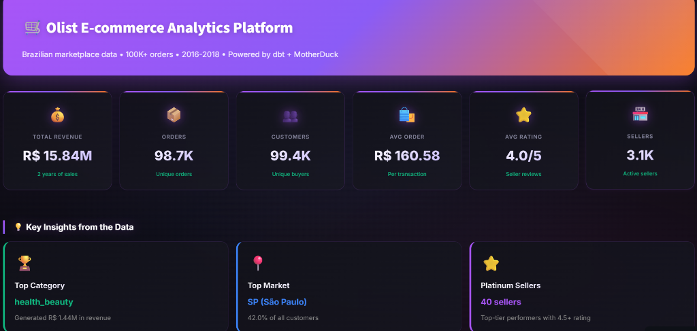
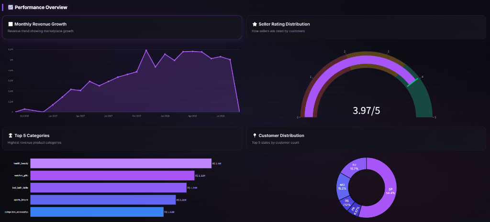

# Olist E-commerce Analytics Platform

[](https://github.com/Mohith-akash/olist-analytics-platform/actions/workflows/ci.yml)

Lakehouse analytics with Databricks, Delta Lake, and Streamlit.

**[Live Dashboard](https://olist-analytics-platform.streamlit.app/)** · **[Dataset](https://www.kaggle.com/olistbr/brazilian-ecommerce)**

## Overview

A complete analytics platform analyzing **100,000+ orders** from Brazilian e-commerce marketplace Olist (2016-2018). Built to demonstrate:

- **Lakehouse Architecture** - Databricks with Delta Lake storage
- **Medallion Pattern** - Bronze → Silver → Gold data layers
- **SQL Expertise** - Complex transformations, CTEs, JOINs
- **Data Visualization** - Interactive Streamlit dashboard
- **CI/CD** - GitHub Actions for linting and testing

---

## Dashboard preview

**KPIs & insights**



**Charts & analytics**



---

## Tech stack

Databricks (lakehouse platform) · Delta Lake (storage) · Streamlit (dashboard) · Python 3.11 · GitHub Actions (CI)

---

## Architecture

```
                    ┌─────────────────────────────────────────────────────┐
                    │              Databricks Lakehouse                   │
                    │                                                     │
CSV Files ─────────►│  ┌──────────┐   ┌──────────┐   ┌──────────────┐    │
                    │  │  Bronze  │──►│  Silver  │──►│    Gold      │    │
                    │  │  (raw)   │   │ (clean)  │   │ (analytics)  │    │
                    │  │ 9 tables │   │ 7 tables │   │  4 tables    │    │
                    │  └──────────┘   └──────────┘   └──────────────┘    │
                    │                                       │            │
                    │              Delta Lake Storage       │            │
                    └───────────────────────────────────────┼────────────┘
                                                            │
                                                            ▼
                                                    ┌──────────────┐
                                                    │  Streamlit   │
                                                    │  Dashboard   │
                                                    └──────────────┘
```

### Medallion Architecture

| Layer | Tables | Description |
|-------|--------|-------------|
| **Bronze** | 9 tables | Raw data ingested from CSV files |
| **Silver** | 7 tables | Cleaned, typed, and validated data |
| **Gold** | 4 tables | Business-ready facts and dimensions |

### Data Models (Gold Layer)

| Model | Description |
|-------|-------------|
| `fct_orders` | Order facts with revenue metrics |
| `dim_customers` | Customer dimension with segmentation |
| `dim_products` | Product dimension with sales tiers |
| `dim_sellers` | Seller dimension with performance ratings |

---

## Data governance

The marts live under **Unity Catalog**, which adds governance on top of the lakehouse:

- **Ownership & documentation** - every Gold table carries an owner plus table and column descriptions
- **Access boundaries** - Bronze/Silver/Gold are separate schemas, so raw data and business-ready data can be granted independently
- **Lineage** - Unity Catalog records table-level lineage from Bronze through Gold automatically
- **Audit trail** - queries against the warehouse are visible in Databricks query history

Relevant for any EU/GDPR context: "where does customer data live, who can read it, and what feeds this dashboard" can be answered directly from the catalog.

---

## Quick start

### 1. Clone & Setup Environment

```bash
git clone https://github.com/Mohith-akash/olist-analytics-platform.git
cd olist-analytics-platform

python -m venv venv
.\venv\Scripts\activate        # Windows
source venv/bin/activate       # Mac/Linux

pip install -r requirements.txt
```

### 2. Configure Databricks Connection

Create `.streamlit/secrets.toml`:

```toml
DATABRICKS_HOST = "your-workspace.cloud.databricks.com"
DATABRICKS_HTTP_PATH = "/sql/1.0/warehouses/your-warehouse-id"
DATABRICKS_TOKEN = "your-access-token"
```

### 3. Run the Dashboard

```bash
streamlit run streamlit_app.py
```

---

## Project structure

```
olist_analytics_platform/
├── streamlit_app.py              # Dashboard entry point
├── requirements.txt              # Python dependencies
├── app/                          # Core modules
│   ├── components.py             # Reusable UI helpers
│   ├── database.py               # Databricks SQL connection
│   ├── styles.py                 # CSS styling
│   └── utils.py                  # Formatting utilities
├── tabs/                         # Dashboard components
│   ├── home.py                   # KPIs and overview
│   ├── analytics.py              # Analysis charts
│   ├── query.py                  # Data explorer
│   └── about.py                  # Project info
├── databricks/                   # SQL notebooks (reference)
│   ├── 01_bronze_layer.sql
│   ├── 02_silver_layer.sql
│   └── 03_gold_layer.sql
└── docs/images/                  # Screenshots
```

---

## Dataset

Olist Brazilian E-commerce Dataset — 100K+ orders, 9 tables, 2016-2018. Available on [Kaggle](https://www.kaggle.com/olistbr/brazilian-ecommerce).

---

Built by [Mohith Akash](https://github.com/Mohith-akash) · [LinkedIn](https://www.linkedin.com/in/mohith-akash/)
